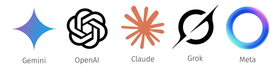

<!-- _class: lead -->
<!-- _paginate: false -->
<!-- _header: '' -->

# Petr's AI School

## 01 - Introduction

---

## Structure

- 8 - 12 sessions for 1 hour every week
- Homeworks because <mark>**practice**</mark> is essential
- After lesson 🍻 and open discussion

---

<!-- _class: lead -->
<!-- _paginate: false -->
<!-- _header: '' -->

## AI is jungle

Models, tools, buzzwords nobody understands...

---

<!-- _class: lead -->
<!-- _paginate: false -->
<!-- _header: '' -->

## AI is changing fast

What is true today - is history tomorrow.

---

## The goal of this courses

* No matter what comes tomorrow, you will be ready
* Easy to swtich Claude → Codex → Gemini → WHO-KNOWS-WHAT?
* Master the fundamentals - no surprises
* Solve **any** task
* Gain superpowers 💪

---

## AI landscape now

* Google - OpenAI - Anthropic - xAI - Meta
* Gemini - ChatGPT - Claude - Grok - Meta 
  

---

## Our pick

### Claude Code 

- Agentic AI
- Best harness
- We all have it (almost)

* Caveats: cant generate images ⚠️

---

<!-- _class: lead invert -->
<!-- _paginate: false -->
<!-- _header: '' -->
<!-- _footer: '' -->

# Why?

---

## Chat - Work - Code

* **Chat** is your advisor 
  - friend on the phone
* **Work** is you external contractor
  - more capable but you can not controll what he can do
* **Code** is your buddy (or buddies) next to you
  - access to everything you have access to

##### Everything is basically built on top of "Code"

Code > Work > Chat

---

<!-- _class: lead -->
<!-- _paginate: false -->
<!-- _header: '' -->

## Once you master Code, nobody and nothing will stop you and everything else will seems like piece of cake.

---

## Roadmap 

* Claude Code basics
* Folders / Projects / Strucutre
* Sharing projects (collaborating)
* Context (what AI knows)
* Models
* Tokens
* Skills
* Tools *
* MCP servers (connectors)

* Advance Claude Code
* Workflows
* Loops
* Headless
* Git - sharing and versioning

---

## Demo time

- Claude Code and UI (doesnt matter)
- Folders / Projects
- Tools
- Models
- Context
- Tokens

---

<!-- _class: lead -->
<!-- _paginate: false -->
<!-- _header: '' -->

# Questions?

