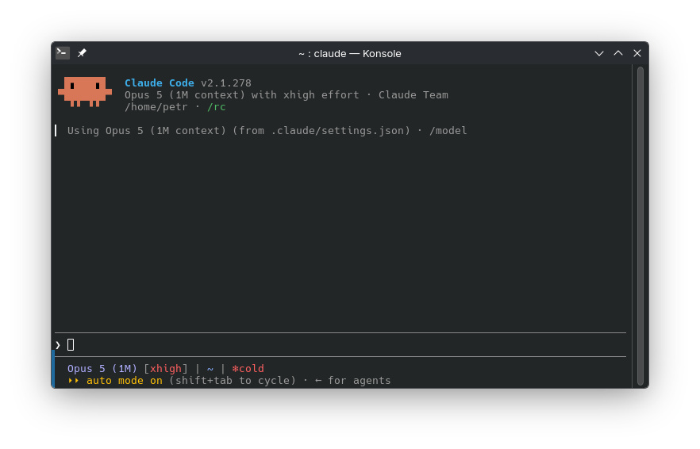
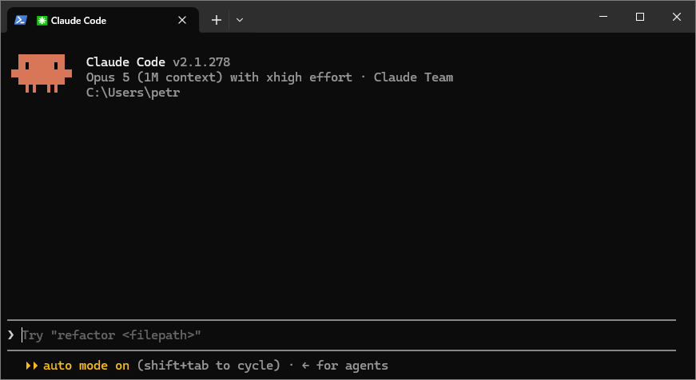
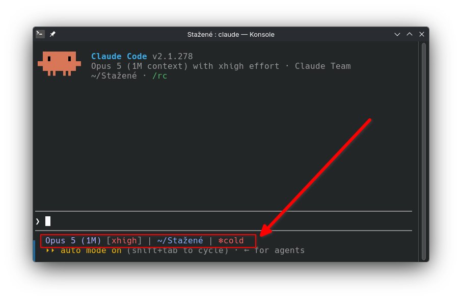
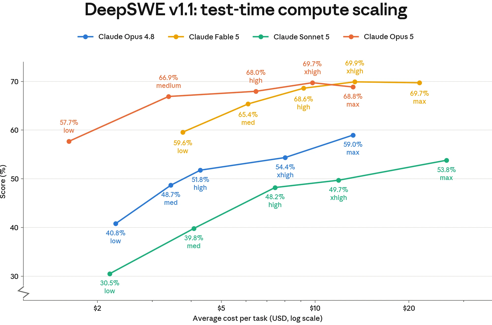

<!-- _class: lead -->
<!-- _paginate: false -->
<!-- _header: '' -->

# Petr's AI School

## 02 - Meet Claude Code



---

## What surprised you?

### Homework 01 - setup Claude Code

- What did you tell it to do?
- What was the output?


---

## Today

Lets discover what Claude Code has to offer.

<div class="cols">
<div>

- starting claude code
- command line
- keyboard shortcuts
- models
- context
</div>

<div>

- modes
- referencing @files
- tools
- status line

</div>

---

## Start in a folder

<div class="cols">
<div>

**Windows:** right-click `ai-school`, **Open in Terminal**, type `claude`

**Mac:** drag the folder onto Terminal, type `claude`

</div>
<div>

**VS Code:** File, Open Folder, then the Spark icon ✦

**Desktop app:** Code tab, Select folder

</div>
</div>

Same folder, different window.

<div class="box task">

Lets open your `Downloads` folder - there is going to be definitely something interesting.

</div>

---

<!-- _class: tight -->

## The screen




- **Top:** which model, which folder. Whatever is in that folder, it can read.
- **The `>` line:** where you type.
- **Bottom:** which mode you are in. The work shows above the prompt as it happens.

---

<!-- _class: tight -->

## Watch the tools

<div class="box task">

Type: `what is in this folder?`

</div>

```text
⏺ Bash(ls)
  ⎿  budget.xlsx  notes.md  offer.pdf
⏺ Read(notes.md)
  ⎿  Read 42 lines
```

- Every ⏺ line is a **tool**.
- The model asked for it. The harness ran it. The result went back to the model.
- <kbd>Ctrl</kbd> + <kbd>O</kbd> shows the whole transcript, every tool call.

---

## The loop


<span class="caption">Diagram: Anthropic, Claude Code docs</span>

Gather context, take action, check the result, repeat. You can press <kbd>Esc</kbd> at any point.

---

## Model + harness + tools, seen live

<div class="cols-3">
<div>

### Chat
Model only.
Cannot see your files.
Set of limited tools from Anhropic.

</div>
<div>

### Work
Model + tools inside one folder you hand over.
Tools living party in Anthropic Cloud.

</div>
<div>

### Code
Model + every tool on your computer.
You set the mode.

</div>
</div>

<div class="box key">

Code is ultimate power over the tools. 💪

</div>

---

<!-- _class: tight -->

## Slash commands

Type `/` and a menu opens. Keep typing to filter it.

<div class="cols">
<div>

| Type      | Does               |
| --------- | ------------------ |
| `/help`   | lists everything   |
| `/clear`  | new conversation   |
| `/resume` | pick an old one    |
| `/model`  | change the model   |
| `/effort` | how hard it thinks |

</div>
<div>

| Type          | Does                          |
| ------------- | ----------------------------- |
| `/context`    | how full the whiteboard is    |
| `/usage`      | how much of your plan is left |
| `/memory`     | your instructions files       |
| `/statusline` | set up the status line        |
| `/exit`       | leave                         |

</div>
</div>

<div class="box task">

Type `/` and look. Then run `/help`.

</div>

---

<!-- _class: tight -->

## Six keys

| Key                               | Does                                                        |
| --------------------------------- | ----------------------------------------------------------- |
| <kbd>Esc</kbd>                    | stop what it is doing                                       |
| <kbd>Esc</kbd> <kbd>Esc</kbd>     | clear what you typed; on an empty line: rewind file changes |
| <kbd>Shift</kbd> + <kbd>Tab</kbd> | switch permission mode                                      |
| <kbd>↑</kbd>                      | your previous prompt                                        |
| <kbd>Tab</kbd>                    | accept a suggestion                                         |
| <kbd>?</kbd>                      | on an empty line: every shortcut                            |

Nice to know: <kbd>Ctrl</kbd> + <kbd>C</kbd> clear or exit · <kbd>Ctrl</kbd> + <kbd>L</kbd> redraw · <kbd>Shift</kbd> + <kbd>Enter</kbd> new line · `!` runs a terminal command · <kbd>Ctrl</kbd> + <kbd>V</kbd> paste an image (Windows: <kbd>Alt</kbd> + <kbd>V</kbd>) · <kbd>Alt</kbd> + <kbd>P</kbd> model · <kbd>Ctrl</kbd> + <kbd>O</kbd> transcript

Everything else is on the cheat sheet in the wiki.

---

## Pointing at files

- Type `@` and the first letters of the name, then <kbd>Tab</kbd>
- Drag a file from Explorer into the window
- Paste a screenshot: <kbd>Ctrl</kbd> + <kbd>V</kbd> (Windows: <kbd>Alt</kbd> + <kbd>V</kbd>)
- Folders work too: `@` and a folder name points at the whole folder

<div class="box task">

Type: `summarise @notes.md in three bullets`

</div>

---

<!-- _class: tight -->

## Live demo: your status line



<div class="box task">

Type: `/statusline show the model, the folder name and how full the context is in %. Like "Opus | C:/Users/Petr | 85%`

</div>

It set itself up by writing two files. You saw each step. Nothing appears? The wiki guide **Set up a status line** has the manual way.

<!--
Fallback: if /statusline fails on a Windows laptop, open the wiki guide and show the two files. Do not debug on stage.
-->

---

<!-- _class: tight -->

## Models and effort

<div class="cols">
<div>

### Model: which brain
`/model` or <kbd>Alt</kbd> + <kbd>P</kbd>

- **Fable** the expert, slow
- **Opus** hard work
- **Sonnet** everyday work
- **Haiku** quick and cheap

</div>
<div>

### Effort: how long it thinks
`/effort low` up to `/effort max`

- high is the default
- low for chores
- max when it is hard and you can wait

</div>
</div>

Risky task? A stronger model, not a cheaper one.

<div class="box task">

Type `/model`, look, press <kbd>Esc</kbd>.

</div>

---

<!-- _footer: '' -->



---

## Context: the whiteboard

- `/context` shows how full it is. Your status line shows the % all the time.
- `/clear` hangs up a new whiteboard. The old one is saved.
- `/resume` brings an old one back.
- `/compact` summarises the whiteboard to make room.
- From the terminal: `claude -c` continues the last one.

<div class="box task">

`/context`, then `/clear`, then `/resume` and pick the one you just left.

</div>

---

<!-- _class: tight -->

## Permission modes: <kbd>Shift</kbd> + <kbd>Tab</kbd>

| Mode         | Label at the bottom  | Runs without asking                  |
| ------------ | -------------------- | ------------------------------------ |
| Manual       | `⏸ manual mode on`   | reading only                         |
| Accept edits | `⏵⏵ accept edits on` | reading and file edits               |
| Plan         | `⏸ plan mode on`     | reading, then it writes a plan       |
| Auto         | `⏵⏵ auto mode on`    | everything a second model calls safe |

You start in **Auto** on paid plans. The habit: **Plan, then Auto.**

<div class="box task">

<kbd>Shift</kbd> + <kbd>Tab</kbd> to Manual. Type `rename notes.md to notes-old.md`. Read the question. Press <kbd>Esc</kbd> to say no. Then <kbd>Shift</kbd> + <kbd>Tab</kbd> until Plan.

</div>

---

<!-- _class: tight -->

## Your turn

<div class="box task">

In Plan mode, type:

`Make a file called index.md that lists every file in this folder with one line about each. Do not change the other files.`

1. Read the plan. Argue with it if you want.
2. Choose **Yes, and use auto mode**.
3. Watch the ⏺ lines.
4. Open `index.md` in Explorer. It is there.
5. Press <kbd>Esc</kbd> <kbd>Esc</kbd> and pick the rewind. It is gone.

</div>

---

## Nothing to fear

<div class="box key">

- <kbd>Esc</kbd> stops it - **dont be afraid to use it**
- <kbd>Esc</kbd> <kbd>Esc</kbd> undoes file edits
- It works only in the folder you opened
- `/clear` resets the whiteboard
- A usage limit pauses you. Nothing breaks
- Keep a copy of anything precious

</div>

---

## Chat, Work, Code: which one?

- **Chat** when there are no files. A question, a draft, a translation. Few tools.
- **Work** when the task lives in one folder and you want a result quickly and want to go away from it.
- **Code** when you want the full toolbox: many folders, programs, the web. And you watch each step. Reuse, build. 

<div class="box key">

Same brain in all three. More tools, more it can do.

</div>

---

<!-- _class: tight -->

## Homework

1. Make the status line yours. Tell `/statusline` what you want, in your own words.
2. One real task. Copy a messy folder of yours. Plan, read, then Auto: sort the files into subfolders, unsure ones into `_review`.
3. Find one slash command we did not cover. Bring what it does.
4. Bring an answer: which tool call surprised you?

<div class="box tip">

Work on a copy. The original stays where it is.

</div>

---

## Terms from today

Slash command · Session · Effort · File mention · Permission mode · Context window · Tool · Harness · Model · Claude model family · Chat, Work and Code · Terminal · Project

All of them are linked from the lecture page in the wiki.

---

<!-- _class: lead -->
<!-- _paginate: false -->
<!-- _header: '' -->

# Questions?
