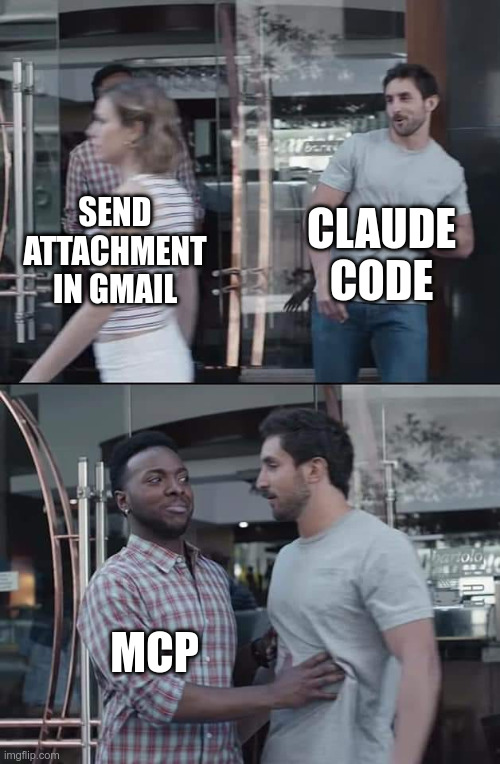

<!-- _class: lead -->
<!-- _paginate: false -->
<!-- _header: '' -->

# Petr's AI School

## 03 - Gearing up

---

## What happened?

### Homework 02

- What did you achieve?
- Which tool call surprised you?
- Which slash command did you find?

<!--
Three minutes, not more: the deck is full.
-->

---

<!-- _class: lead -->

## Gearing up


This is Claude Code.

Let's add some tools to the Code!

<!--
Play the clip from YouTube. Do not put a still from the film in this deck: the deck is CC BY-SA and the film is not.
Say what the clip is: the gearing-up scene from the film Commando (1985).
-->

---

<!-- _class: tighter -->

## Same brain, different gear

<div class="cols-3">
<div>


**Chat:** phone support. Knows a lot and can talk. It can also search the web, use connectors and run small programs in a sandbox in the cloud.

</div>
<div>


**Work:** a contractor with a toolbox. Only the folders you open for it, its own sandbox, connectors. The other doors stay locked.

</div>
<div>


**Code:** full gear. Your whole computer: every program and your logins, the web, connectors.

</div>
</div>

<span class="caption">Sandbox: a closed box where Claude can run programs. What happens inside does not touch your own computer.</span>

<div class="box key">

The same model in all three. The gear makes the difference.

</div>

<!--
Recap of lecture 02 (model + harness + tools). Today: what the gear is, and how to add more.
-->

---

<!-- _class: tight -->

## Let's recap what a tool is

- The model can only think and write. It has no hands.
- So the harness gives it **buttons**. Each button does one job. Each has a label and a few boxes to fill in.

```text
[ Read a file ]   [ Write a file ]   [ Run a program ]
[ Search the web ]   [ Find emails ]   [ Create an event ]
```

- A **tool** is one of these buttons. A **tool call** is the model picking one and filling in the boxes. The harness presses it.
- The model picks a button from your request and the button's description.

<div class="box key">

The more buttons, the more it can do.

</div>

<!--
Exact wording in the Claude API docs (Tool use): "Claude determines when to call a tool based on the user's request and the tool's description."
-->

---

<!-- _class: tight -->

## One tool call, step by step

<div class="cols">
<div>

### What the model sees

```text
Tool:   search_threads
Does:   searches your Gmail
Boxes:  query (the search words)
```

### What the model writes

```text
search_threads(query: "invoice from:accountant")
```

</div>
<div>

### What happens

1. The harness gives the model the list of tools (names first, details when needed).
2. The model writes a request: which tool, what to fill in.
3. The harness runs it. Often it asks you first.
4. The answer comes back **as text**, into the context.
5. The model reads it and picks the next step.

</div>
</div>

<div class="box key">

The model never touches anything itself. No tool, no action.

</div>

<!--
Step 1 in detail: for connector tools the model first gets only the names, and looks up the rest (what it does, what to fill in) when it needs one. So a connector you do not use costs almost nothing.
-->

---

<!-- _class: tight -->

## Everything goes through a tool

```text
⏺ Read(notes.md)                             the Read tool, built in
⏺ Bash(ffmpeg -i talk.mp4 -vn talk.mp3)      the Bash tool runs a program
⏺ claude.ai Gmail - search_threads (MCP)     a connector's tool
⏺ Fetch(https://ares.gov.cz/...)             the Fetch tool opens a web address
```

- Every ⏺ line is a tool call. You saw them in lecture 02.
- On Windows you may see `PowerShell(...)` instead of `Bash(...)`. Same job.
- A connector gives Claude new tools. A new program gives the "run a program" tool something new to run.

<div class="box key">

Claude reaches only what its tools reach. No tool for your CRM? Then it cannot see your CRM.

</div>

<!--
ffmpeg and ARES come back later today. Just say "you will meet these later".
-->

---

<!-- _class: tight -->

## Types of tools

<div class="cols">
<div>

### Built-in tools
They come with the harness. Ready on day one.

Read, write and change files. Find files. Search the web. Open a web page. **Run a program.**

</div>
<div>

### More gear
- **Connectors (MCP):** new buttons for one service.
- **Command-line programs (CLI):** programs you use by typing. The "run a program" tool runs them.
- **APIs and scripts:** Claude writes a small script and runs it.
- **The screen:** when nothing else works.

</div>
</div>

<div class="box key">

Only a connector adds new buttons. Programs, scripts and APIs use the built-in ones.

</div>

<!--
CLI = command-line interface. The screen is a connector that comes with Claude, off until you turn it on (computer use); it is covered near the end.
-->

---

<!-- _class: tighter -->

## The built-in tools

| On the ⏺ line | Does |
| --- | --- |
| `Read` | reads a file: text, PDF, picture |
| `Write` | makes a new file |
| `Update` | changes part of a file |
| `Search` | finds files, or finds text inside files |
| `PowerShell`, `Bash` | runs a program or a command |
| `Web Search` | searches the internet |
| `Fetch` | opens one web page |
| `Agent` | sends a helper (lecture 05) |

<div class="box key">

"Run a program" is the big one. It opens your whole computer.

</div>

<!--
Cut if short on time.
PowerShell on Windows; Bash on a Mac, and on Windows with Git Bash. About 45 built-in tools in total. Internal names: Edit shows as Update, Glob and Grep as Search, WebFetch as Fetch, WebSearch as Web Search. On a Mac, Claude usually searches through Bash instead of the Search tool.
Claude Code docs: "To add custom tools, connect an MCP server."
-->

---

<!-- _class: tight -->

## One service, several ways in

```text
You     →  gmail.com (the window)      →  your mailbox

Claude  →  the Gmail connector (MCP)   →  Gmail API  →  your mailbox
Claude  →  gws (command line)          →  Gmail API  →  your mailbox
Claude  →  a small script              →  Gmail API  →  your mailbox
```

- The **API** is Gmail's way in for programs.
- `gws` is a free command-line program for Gmail, Drive, Calendar and more.
- A **script** is a small file with steps that Claude writes and runs. You keep it.
- They all reach the same mailbox. They differ in what they let Claude do. That is the rest of today.

---

<!-- _class: tight -->

## MCP: the USB-C port for AI

> "Think of MCP like a USB-C port for AI applications." <span class="caption">modelcontextprotocol.io</span>

- MCP means Model Context Protocol. **Connector**, **MCP server** and **MCP**: people use all three words for the same thing.
- One plug shape for every AI app and every service.
- **Built for AI:** every tool comes with a description the model reads.
- **Built for convenience:** switch it on, sign in, done.
- Runs at the service (Gmail, HubSpot) or on your computer (Blender).
- An open standard: it works in Claude, ChatGPT, VS Code and more.

<!--
Since December 2025 MCP belongs to the Agentic AI Foundation, a fund under the Linux Foundation (co-founded by Anthropic, Block and OpenAI).
Other local servers exist too, for example for FreeCAD.
-->

---

<!-- _class: tight -->

## Someone made it

```text
Claude  →  Gmail connector: about 30 buttons  →  Gmail API: about 80 actions
```

- A connector is a small program in front of a service's API. Someone built it for AI.
- They chose which actions to offer. That list is all Claude gets.
- The Gmail connector can search, read, reply, draft, label and send. It cannot attach a PDF from your folder, or save one.
- Made by the service itself, by Anthropic, or by anybody on the internet.

<div class="box warn">

Check who made it. A connector from a stranger works with your login and your data.

</div>

<!--
Same name, different maker: the official "Affinity MCP server" is for Affinity the CRM, not for the Affinity design app by Canva, which has only community servers.
-->

---

<!-- _class: tight -->

## How to connect

- **The easy way:** at claude.ai, open the connectors, switch one on, sign in. It then shows up in Chat, Work and Code: same account, same connectors.
- **Other connectors:** ask Claude Code to add one for you.
- **Programs with their own server** run on your computer: Blender, for example.

<div class="box task">

Type `/mcp`. Pick a connector. Look at its list of tools.

</div>

<div class="box note">

On a company plan, someone decides which connectors you can switch on. Ask who manages your company's Claude plan.

</div>

<!--
Menu paths (Sep 2026): claude.ai, Customize, Connectors. Custom connector by web address: Customize, Connectors, +, Add custom connector (Free plan: one only; Team and Enterprise: only Owners add them). In Claude Code: `claude mcp add`, and claude.ai connectors appear by themselves with a claude.ai login (not with an API key). Desktop extensions (local servers) work in the desktop app, Cowork and Claude Code, not in the web chat.
-->

---

<!-- _class: tight -->

## It all goes through the context

- A connector answers in text. All of that text lands in the context.
- Ask for 300 emails: 300 emails on the whiteboard.
- For a very big answer, Claude Code warns you. The biggest answers go to a file, and Claude gets the file's name and place. To put that into your spreadsheet, it still has to read it and type it again.

<div class="box tip">

Watch the % in your status line.

</div>

<!--
Numbers: a warning above 10,000 tokens; above 25,000 (the default limit) the answer is saved to a file and the model gets the path.
Anthropic engineering blog, Nov 2025: "Every intermediate result must pass through the model."
-->

---

<!-- _class: tight -->

## MCP: pros and cons

<div class="cols">
<div>

### Pros
- Switch on, sign in. Nothing to install.
- Made for AI: clear buttons, clear boxes.
- Works in Chat, Work and Code, and in other AI apps.
- Only the actions on the list. Fewer ways to go wrong.
- A connector you do not use costs almost nothing.

</div>
<div>

### Cons
- Only the actions on the list. The rest is out of reach.
- Everything goes through the context. Big jobs are slow and use up your limit faster.
- Changes go one at a time: relabel 2,000 emails, 2,000 calls.
- Still real access. It acts as you.

</div>
</div>

---

## Where MCP is best

> A quick way in: look around, and do small things.

- What is on my calendar tomorrow?
- Find the email from the accountant about the September invoice.
- Look up one customer in our CRM.

<div class="box tip">

Small, quick, only once: the connector is the easiest way in.

</div>

<!--
Cut if short on time: say it on the pros and cons slide.
-->

---

## Myth of the week

> Many people believe: to use a program, someone has to open its window and click through it.

- The window is the way in **for people**.
- Most programs have more ways in, **for other programs**: files, the command line, an API.
- Files, for example: Claude can write an Excel file without opening Excel.
- Programmers have used these ways for decades. Now Claude uses them for you.

---

<!-- _class: tight -->

## Claude runs your programs

<div class="cols">
<div>

### What it does
- Runs programs by typing commands
- Calls APIs, gets data from the web
- Installs what it needs with `winget`: the Windows app store, but by typing
- Basically: it uses other programs, the way a programmer would

</div>
<div>

### What changed
- **Before:** a programmer read the manual and wrote the code. Days.
- **Now:** Claude reads the manual in seconds and types the command.
- **You:** learn what a computer can do, ask for it, check the result.

</div>
</div>

<div class="box key">

Code is ultimate power over the tools. 💪

</div>

---

<!-- _class: tight -->

## Little programs, big jobs

| Program | Does | Instead of |
| --- | --- | --- |
| `ffmpeg` | video and audio: cut, convert, shrink | a converter app or website |
| `yt-dlp` | download a video or just its sound | download websites full of ads |
| ImageMagick | resize or convert 200 photos at once | Paint, one photo at a time |
| `pandoc` | Word ↔ Markdown | Save as, file by file |
| LibreOffice | turns a folder of .docx into PDFs without opening them | opening every file |
| `pdftotext` | the text out of a PDF | copy and paste |

You do not need to learn the commands. You need to know the program exists. Claude reads its manual and finds out the rest.

Ask your Claude: `Is there a command-line program that can ...?`

<!--
One line for the window vs command line idea: HandBrake needs clicks through its settings; `ffmpeg -i talk.mp4 -vn talk.mp3` is one line, and a short loop does 200 files. HandBrake and VLC use FFmpeg's engine inside.
-->

---

<!-- _class: tight -->

## Live demo: two programs, one sentence

<div class="box">

`Install yt-dlp and ffmpeg. Download our webinar from this link: ..., cut minutes 5 to 10, and save it as talk.mp3 in this folder.`

</div>

Watch the ⏺ lines:

- `winget install`: Claude installs the programs itself
- `--help`: it reads the manual
- the command, then the file appears in Explorer

<div class="box note">

Download only what you are allowed to: our own recordings, or talks that allow it.

</div>

<!--
Cut if short on time.
Test on the teaching laptop first: after winget installs a program, a Claude Code session that was already running may not find it ("not recognized"), because the new PATH is not loaded yet. Fix: restart Claude Code, or install before the lecture.
Fallback: skip the download, use a video already in the folder.
-->

---

<!-- _class: tight -->

## An API is a web address for programs

- You open a web page and see a page. A program opens an API address and gets data.
- The Czech business register (ARES) has one. No key needed.

```text
ares.gov.cz/ekonomicke-subjekty-v-be/rest/ekonomicke-subjekty/45274649
```

```json
{ "ico": "45274649",
  "obchodniJmeno": "ČEZ, a. s.",
  "sidlo": { "textovaAdresa": "Duhová 1444/2, Michle, 14000 Praha 4" },
  "datumVzniku": "1992-05-06" }
```

- No design, no buttons. Only the facts, each with a name.
- Most APIs need a **key**: a password for programs. You get it from the service.

---

## Your turn: ask an API

<div class="box task">

Type: `Look up ČEZ in the ARES register and save its name, address and company ID to company.csv.`

Then do the same for a company you know.

</div>

Watch the ⏺ lines: which tool does it use? Then open `company.csv` in Explorer.

<!--
Claude usually uses Fetch, or writes a small script. Either is fine: both use the API.
-->

---

<!-- _class: tight -->

## The picture again: four ways in

| Way | What it is | Good for |
| --- | --- | --- |
| **Connector (MCP)** | buttons someone built for one service | a quick look, small jobs |
| **Command-line program** | a program on your computer. Claude types one line | big jobs, results in files |
| **Script** | a small file with steps. Claude writes it and runs it. You keep it | when there is no program |
| **API** | the service's way in for programs. The three above all use it | everything the service offers |

The window is still there, for you.

<!--
Cut if short on time: it repeats "One service, several ways in" with the new words.
-->

---

<!-- _class: tight -->

## Through the context, or past it

<div class="cols">
<div>

### Through the connector
"Export all our CRM contacts."
Page by page, every contact passes through the context. Then Claude types each row again into a file.
Slow, uses up your limit, and a row can go missing.

</div>
<div>

### Past the context
Claude uses a command-line program, or writes a small script for the API.
The data goes straight into `contacts.csv`.
Claude sees one line: "saved 4,812 contacts".

</div>
</div>

<div class="box tip">

Same job. Only one of them fills your context, and only one can lose a row.

</div>

---

<!-- _class: tight -->

## Programs on your computer: pros and cons

<div class="cols">
<div>

### Pros
- Almost anything a computer can do. Usually far more than the connector.
- Big data goes straight into files, past the context.
- Fast: a thousand items in one command.
- One program can cover many services: `gws` does Gmail, Drive, Calendar, Sheets and Docs.

</div>
<div>

### Cons
- Some setup. `gws` needs one file from your admin or teacher first.
- Your own programs and logins: only in Code. Work can install programs in its sandbox, but reaches only the websites on its allowed list.
- Full power, as you. Plan first, then Auto.
- Not every program is official. Ask Claude who makes it.

</div>
</div>

<!--
The file for gws is client_secret.json. The wiki guide Connect Google Workspace has the steps.
-->

---

<!-- _class: tight -->

## When nothing else works: the screen

- Claude can use any window it can see: screenshot, think, click, screenshot again.
- It works with any program. It is very slow, and it stops working when a button moves.
- On Windows, only the Claude desktop app can do it: Settings, turn on computer use.
- On a Mac, Claude Code in the terminal can do it too.
- Pro and Max plans only. On a company Team plan it is not there.
- For websites there is **Claude in Chrome**, an extension for your browser. It uses your logins, so it acts as you.

Claude tries the screen last.

<!--
Docs wording: "Computer use is the broadest and slowest, so Claude tries the most precise tool first." In Claude Code, computer use is itself a built-in MCP server, off by default.
-->

---

<!-- _class: tighter -->

## Which gear each one gets

| | Chat | Work | Code |
| --- | --- | --- | --- |
| Connectors from claude.ai | ✓ | ✓ | ✓ |
| Runs programs | in a sandbox in the cloud | in its own sandbox, usually in the cloud | on your computer, as you |
| Your installed programs and logins | ✗ | ✗ | ✓ every one |
| APIs with your own key | clumsy | clumsy | ✓ |
| The screen | ✗ | ✓ Pro and Max | ✓ Pro and Max (Windows: desktop app only) |

<div class="box key">

All three get connectors. Only Code uses the programs on your own computer. That is the full gear.

</div>

<!--
Sources: Claude help center (connectors, Cowork architecture, code execution, computer use) and Claude Code docs, checked 29 Sep 2026.
More detail if asked: custom connectors by web address work in all three. Local MCP servers: in Chat only in the desktop app, not the web. Work runs code in an isolated sandbox, in Anthropic's cloud by default (some company plans run it on your own machine), with a list of allowed websites. It reaches your connected folders through the desktop app. APIs in Chat: the key would have to go into the chat. Team plans: an Owner switches connectors on, only Owners add custom connectors, and there is no computer use in any product.
-->

---


<!-- _footer: '' -->



<!--
The connector can send a plain email. It cannot attach a file from your folder. That is the joke.
-->

---

<!-- _class: tighter -->

## Google Workspace: Gmail connector vs `gws`

| Job | Gmail connector (MCP) | `gws` (command line) |
| --- | --- | --- |
| Search, read, reply, draft, send | ✓ | ✓ |
| Send a PDF from your folder | ✗ | ✓ |
| Save attachments into a folder | ✗ | ✓ |
| Relabel 2,000 emails | 2,000 calls, one per email | a few commands |
| Filters, out-of-office, signatures | ✗ | ✓ |
| Drive, Calendar, Sheets, Docs | Drive and Calendar: one connector each | the same program |
| Setup | switch on, sign in | install, log in, one file from your admin |

<div class="box note">

The connector is made by Google. `gws` is free and on Google's GitHub, but "not an officially supported Google product".

</div>

<!--
Wiki guide: Connect Google Workspace (gws 0.22.5, March 2026). Sending a file through the connector would mean the model types the whole file out inside the call: not practical. Docs and Sheets are reached only as files through the Drive connector. Batch relabel takes up to 1,000 emails per call.
-->

---

<!-- _class: tight -->

## One sentence, five steps

<div class="box">

`Find every invoice email from September. Save the PDFs into invoices\2026-09, named by supplier and date. Then make summary.csv with the totals.`

</div>

```text
⏺ Bash(gws gmail users messages list ... --page-all)          23 emails found
⏺ Bash(gws gmail users messages attachments get ...)  × 23    saved as data
⏺ Bash(... a small script turns the data into PDFs ...)       23 PDFs in the folder
⏺ Bash(pdftotext ...)                                         text read
⏺ Write(invoices\2026-09\summary.csv)                         the table
```

- Two tools: `Bash` runs gws, a small script and pdftotext. `Write` makes the table.
- The connector cannot save the PDFs at all.
- The PDFs go past Claude, straight into your folder. Claude reads their text, not the files.

<!--
Cut if short on time, or if the invoice demo has not run on the teaching laptop yet.
Replace these lines with a real screenshot once the invoice demo has run on the teaching laptop.
Test on the teaching laptop first: gws takes JSON in --params, and quoting JSON through the PowerShell tool (especially Windows PowerShell 5.1) often goes wrong. Through Bash (Git Bash) it works as shown. --page-all stops after 10 pages unless --page-limit is raised.
-->

---

<!-- _class: tight -->

## HubSpot: several ways in

| Way | Setup | What it can do |
| --- | --- | --- |
| The HubSpot connector (claude.ai) | switch on, sign in | look up, search, change up to 10 records at a time. On our account: no newsletters |
| HubSpot's own MCP server | an app in HubSpot, then a custom connector at claude.ai, then sign in | a slightly different set of buttons. On our account: newsletters too |
| HubSpot Agent CLI (beta) | install, log in once in the browser | all CRM records, in bulk: delete, merge, workflows. Check it out, could be best of all |
| The HubSpot API | a key from your HubSpot admin, a small script | everything. Claude writes the script |

<div class="box tip">

Both are made by HubSpot. The buttons you get depend on your HubSpot plan and on what you allow when you connect. Both are small next to the CLI.

</div>

<!--
Why two MCP servers: the claude.ai connector showed no newsletter (marketing email) buttons, so HubSpot's own server was added for them. HubSpot documents marketing emails for both, and says "Tool availability varies by HubSpot subscription, user permissions, and account configuration". Permissions are chosen when you connect; new ones need a reconnect. Before the lecture: reconnect the claude.ai connector, allow marketing, and compare /mcp. HubSpot's own list for its server has 32 tools and is not called complete.
Note: the claude.ai HubSpot connector is made by HubSpot (mcp.hubspot.com/anthropic, July 2025), not by Anthropic. The custom server at mcp.hubspot.com is not "almost everything": 22 tools are the same (28 and 29 in Claude Code, 29 Sep 2026), it adds marketing emails, custom properties and pipelines and the inbox, and it lacks blog posts, website pages and saved reports. Both: no delete, 10 records per change, every answer through the context. It needs an MCP auth app in HubSpot; on Team plans only an Owner can add a custom connector.
Keys: from 26 Oct 2026 existing accounts cannot create new private apps (new accounts from 28 Sep 2026). Old private apps keep working. New keys are service keys.
-->

---

<!-- _class: tight -->

## HubSpot Agent CLI: the big jobs

- Made by HubSpot mainly for AI agents such as Claude Code. Public beta since June 2026. The command is `hubspot`.
- Log in once: `hubspot auth login` opens the browser. It gets your own HubSpot rights, no more.
- Does what both connectors cannot: delete, merge duplicates, edit workflows and pipelines, save every record into a file.
- Beta, and it deletes for real. Ask for `--dry-run` first: it shows what would change, and changes nothing.
- Ask your HubSpot admin before you install it.

<div class="box key">

HubSpot's own advice: the connector for talking and small steps you check one by one. The CLI for big jobs and jobs that repeat.

</div>

<!--
Exact wording (HubSpot developer changelog, 23 Jun 2026): the CLI is "designed for AI agents to consume and use"; the MCP server suits "conversational, human-in-the-loop workflows"; the Agent CLI is for "repetitive, bulk, and scheduled work".
Not the old HubSpot CLI (`hs`): that one is for developers and does not manage CRM data.
Test on the teaching laptop first: the Windows install is one PowerShell line from HubSpot's docs, then open a new terminal. The official "export everything" helper is a bash script that needs jq (and adding the skills needs Node.js). Without Git Bash and jq, Claude has to write its own loop. Run a full contacts export once before the lecture.
-->

---

## Live demo: our CRM

Lets fetch some data from our HubSpot CRM and compare the results and speed of each tool.

- Anthropic HubSpot Connector
- Official HubSpot CRM
- HubSpot CLI

<!--
Internal data only on the live screen. Nothing from the CRM goes into the slides.
Step 3 only if a full export with the HubSpot CLI has run once on the teaching laptop.
-->

---

## Careful

<div class="box warn">

- Whatever you connect, Claude can read and often change.
- It acts as you, through every way in.
- A **key is a password**. Never paste it into the chat: the chat is saved in your history and sent to the model.
- An email can contain orders for Claude, like "ignore your instructions". Claude may follow them. Read its plan before you say yes. → **Prompt injection**
- Before you connect a company system, ask who manages your company's Claude plan.

</div>

---

<!-- _class: tight -->

## Your turn

<div class="box task">

Pick one:

1. `What are all the ways you could work with Excel on this computer? Which one would you pick to fill 1,000 rows, and why?`
2. `Which of my connectors could save my Gmail attachments into a folder? If none can, what would you use instead?`
3. `Is there a command-line program that can make all the photos in this folder smaller? Tell me first. Do not install anything yet.`

</div>

No connectors yet? Pick 1 or 3. Watch which way it picks, and which tools it calls.

---

<!-- _class: tight -->

## Key takeaways

1. Everything Claude does, it does with a tool: a button the harness gives the model. No tool, no action.
2. Learn what MCP is: a ready set of buttons for one service. Know what makes it easy and where it stops: great for a quick look and small jobs, and everything goes through the context.
3. A **CLI** is a program you use by typing. An **API** is a service's way in for programs.
4. Claude Code can use your computer and all its programs way more effectively. It is more about learning how a computer works and letting the AI do the hard work for you.
5. Small job: the connector. Big job, or a file at the end: a command-line program or a script. Only Code has all of it.

---

<!-- _class: tight -->

## Homework

1. Pick one program or service you use every day. Ask Claude for every way in it has. Try one that needs nothing from an admin: a file export, a public API, a small program.
2. Switch on the Google Calendar or Drive connector, if your plan lets you. Do one small task. Then ask how Claude would do a big version, for example every meeting of the last three months in a spreadsheet, and which way it would use.
3. One real task from your own work, in a project folder: Plan, then Auto.
4. Bring one task you do every week. Next time we make it repeat.

<div class="box tip">

Want more? The wiki guide **Connect Google Workspace** sets up `gws`. You need one file from your admin or teacher first.

</div>

---

## Terms from today

Tool · Harness · Connector (MCP) · Command-line program (CLI) · API · Script · Sandbox · Computer use · Prompt injection · Context window · Chat, Work and Code · Permission mode

Guide: Connect Google Workspace

All of them are linked from the lecture page in the wiki.

---

<!-- _class: lead -->
<!-- _paginate: false -->
<!-- _header: '' -->

# Questions?
