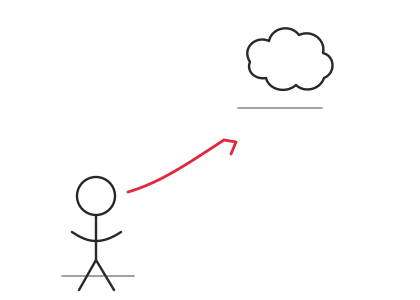

<!-- _class: lead -->
<!-- _paginate: false -->
<!-- _header: '' -->

# Theme preview

Same content, one file per theme

---

## Typography and emphasis

Body copy sits at a comfortable reading size with **bold**, *italic* and
`inline code` mixed in. A [link](https://marp.app/) looks like this, and
<mark>a highlight</mark> like that.

##### KICKER LABEL

- A first bullet point
- A second one, with a nested child
  - The nested child
- A third point to show rhythm

---

## Code and data

```python
def attention(q, k, v):
    scores = q @ k.T / math.sqrt(q.shape[-1])   # scaled dot product
    return softmax(scores) @ v
```

| Model | Year | Params | Open |
| :--- | ---: | ---: | :---: |
| BERT | 2018 | 340M | yes |
| GPT-3 | 2020 | 175B | no |
| Llama 3 | 2024 | 405B | yes |

---

## Quotes and tags

> Machines take me by surprise with great frequency.
>
> *Alan Turing*

<div class="box">

A plain `box` with no variant: just a frame, for when you only need one.

</div>

<span class="chip">tag</span> <span class="chip">another</span>

---

## Callouts

<div class="box note">

Language models predict the next token. Everything else builds on that.

</div>

<div class="box tip">

Ask for the reasoning **before** the answer. It measurably helps.

</div>

<div class="box warn">

A model answers confidently even with no grounds to.

</div>

---

## Callouts, continued

<div class="box key">

Data, compute and architecture arrived together. No single one was enough.

</div>

<div class="box task cs">

Vyber si jednu činnost, kterou děláš ručně každý týden, a popiš ji.

</div>

<span class="caption">The `cs` class switches the label to Czech.</span>

---

## Columns and numbers

<div class="cols-3">
<div>

<span class="stat">175B</span>
<span class="stat-label">GPT-3 parameters</span>

</div>
<div>

<span class="stat">2017</span>
<span class="stat-label">transformer paper</span>

</div>
<div>

<span class="stat">~4</span>
<span class="stat-label">chars per token</span>

</div>
</div>

Inline maths still works: $\mathcal{L} = -\sum_i y_i \log \hat{y}_i$

---

## Drawings and margin notes

<div class="cols">
<div>

A drawing sits straight on the page. The `ink` class multiplies it onto
the ground so a white PNG leaves no visible box.

<div class="margin-note">

and this is a note in the margin

</div>

</div>
<div class="ink">



</div>
</div>

---


## Image split

The theme keeps text readable next to a full-bleed photo.

<span class="caption">Half-and-half layouts are the most useful image block.</span>

---

<!-- _class: invert lead -->
<!-- _paginate: false -->
<!-- _header: '' -->

# Inverted

For section dividers

---

# Many things

## Another thing

### Another another thing

#### Lever 4 heading

##### Level 5 heading